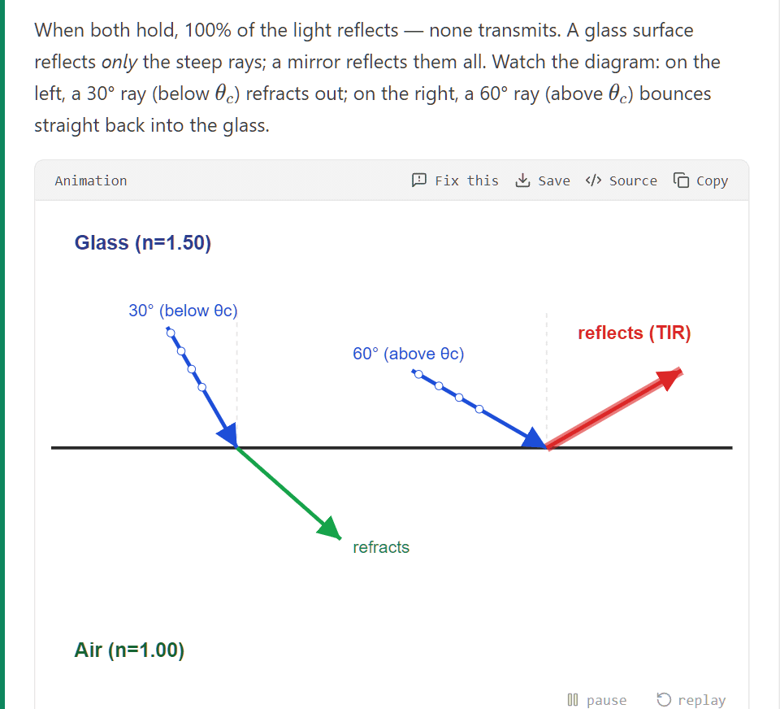
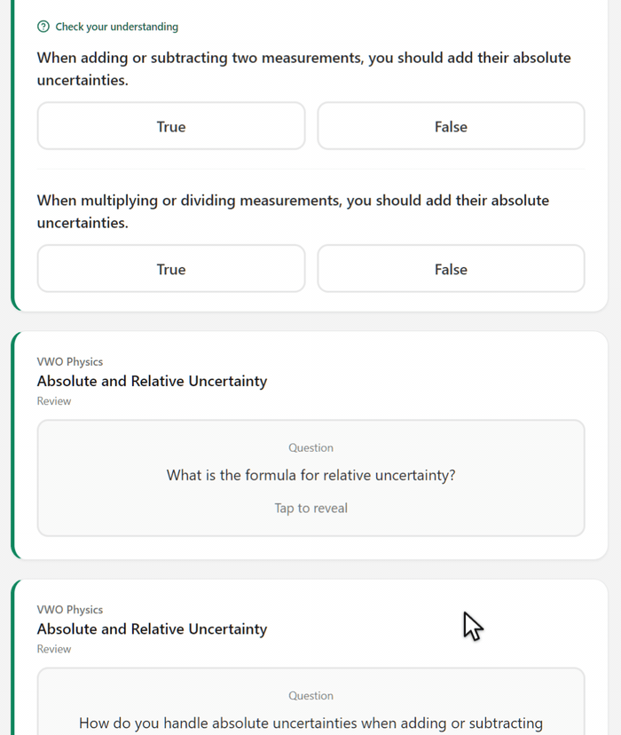
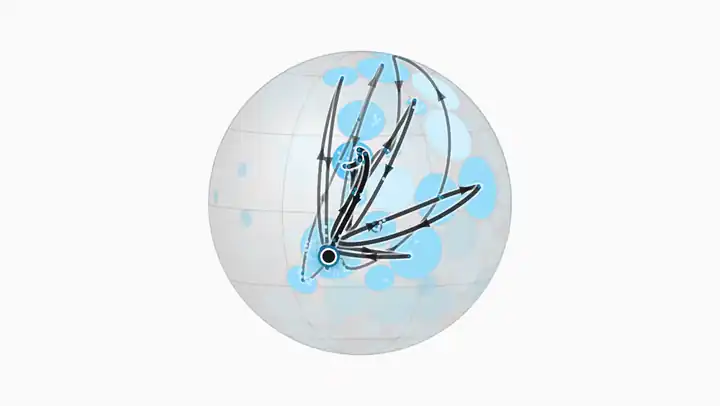
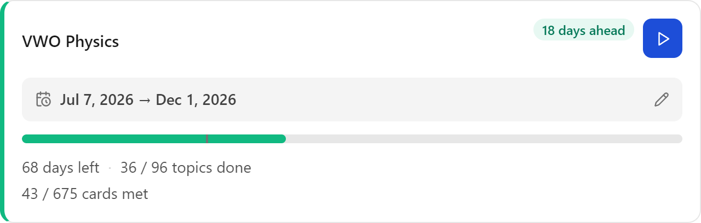

<p align="center">
  <picture>
    <source media="(prefers-color-scheme: dark)" srcset="brand/terramentor-wordmark-dark.svg">
    
  </picture>
</p>

<p align="center"><b>A local-first mastery engine for self-directed learners.</b></p>

<p align="center">
  It plans a course against your deadline, teaches it, asks you to prove each topic before it
  closes, and brings back what you are forgetting. On your machine, with the model you choose.
</p>

<p align="center">
  <a href="https://github.com/ValeraZSD/terramentor/releases">Download</a> ·
  <a href="#install">Install</a> ·
  <a href="docs/GETTING_STARTED.md">First steps</a> ·
  <a href="docs/ARCHITECTURE.md">Architecture</a> ·
  <a href="CHANGELOG.md">Changelog</a> ·
  <a href="SECURITY.md">Security</a>
</p>

<p align="center">
  <a href="SECURITY.md"></a>
  <a href="https://github.com/ValeraZSD/terramentor/actions/workflows/gates.yml"></a>
  <a href="https://github.com/ValeraZSD/terramentor/releases"></a>
  <a href="LICENSE"></a>
  <a href="https://github.com/ValeraZSD/terramentor/pkgs/container/terramentor"></a>
  
</p>

<p align="center">
  
</p>

<p align="center"><sub>A lesson from a real course, VWO Physics (96 topics, 36 of them finished).
The text, the formulas and the animation were written for this topic by the model the app is
pointed at, and the lesson was checked before it was served.</sub></p>

---

## What it does

Most study tools help you organise material you already have. This one does the whole job, in
one loop: **Discover → Plan → Study → Prove → Remember**.

| Stage | What the app does |
|---|---|
| **Discover** | Describe a subject and get a phased tree of topics, or import a course as JSON or a `.studyvault` bundle. A course written by a large cloud model can be pasted straight in. Clip links, paragraphs and photos into an Inbox from anywhere with `c`. |
| **Plan** | Set a start date, a deadline and the days you study. The time between them is spread across the topics by weight, and pace is measured against that plan, not the calendar. Recalibrating re-plans only what is still open. |
| **Study** | The home page is a stream of lessons, questions, flashcards and recall prompts, in an order the engine picks. Visuals the model writes as code (diagrams, charts, animations, sandboxed widgets) are checked and repaired when a model gets one wrong. A tutor per topic answers from your own uploaded files, and an assistant across the whole library can look up a course's progress and prepare a mastery check or a card for you to press. |
| **Prove** | Bayesian Knowledge Tracing per topic, a mastery check that closes a topic honestly, and paper practice: work an exercise by hand, photograph it, and have it marked against a rubric. Skip is always allowed and stays visibly different from proof. |
| **Remember** | FSRS-6 spaced repetition for flashcards, fitted to your own reviews once there are enough of them. Anki decks come in with their media and history, and go back out as `.apkg`. |

**Every AI feature is optional.** With no model reachable it is still a study planner: it
schedules, tracks, serves your notes and saved questions, and runs spaced repetition.

<p align="center">
  
</p>

<p align="center"><sub><b>Prove.</b> Two questions from the topic's own bank, each marked as you answer
it. Recorded with the model switched off: the bank was written earlier and saved with the course.</sub></p>

<p align="center">
  
</p>

<p align="center"><sub><b>The atlas.</b> Every topic in the library, grouped by meaning rather than by
course, on a planet you turn. Here the physics course's 36 finished topics are replayed in the
order they were finished.</sub></p>

<p align="center">
  
</p>

<p align="center"><sub><b>The plan.</b> The same course against its deadline. The bar is what is done,
the notch is where the plan says you should be by today, and the dates are the control: press
them to move the window and re-plan what is still open.</sub></p>

---

## Your data stays on your machine

SQLite on disk and a local model via [Ollama](https://ollama.com), or any OpenAI-compatible
endpoint you point it at. No telemetry, no account, no vendor lock-in. What network traffic
there is goes to the model endpoint you chose, to a resource search while the AI drafts a
project (on by default, one switch to turn off), and to two features that stay off until you
turn them on: web search inside answers, and a daily update check.
[SECURITY.md](SECURITY.md) lists every outbound connection and tells you how to check that list
with a packet capture rather than taking our word for it.

---

## Install

Once it is running, [First steps](docs/GETTING_STARTED.md) is the five-minute tour of the app.

**Desktop app.** Download the zip for your system from the
[releases page](https://github.com/ValeraZSD/terramentor/releases), unpack it anywhere, and start
`Terramentor.exe` (Windows), `Terramentor.app` (macOS, Apple Silicon) or `./terramentor.sh`
(Linux). The zip carries its own runtime, so there is nothing to install. Windows warns once that
the launcher is unsigned (*More info → Run anyway*); macOS needs a right-click → *Open* the first
time. More in [docs/DESKTOP.md](docs/DESKTOP.md).

**Docker**, for a server or an always-on machine. The published image already contains the built app:

```bash
curl -O https://raw.githubusercontent.com/ValeraZSD/terramentor/main/docker-compose.yml
docker compose up -d                                   # then open http://127.0.0.1:3001
docker compose pull && docker compose up -d            # to update; your database is untouched
```

The port is published to loopback only, and everything durable lives on the `terramentor-data`
volume. AI features look for Ollama on the host (a 9–14B instruct model is a sensible floor).

**From source.** Node.js **22.15+** (24+ recommended):

```bash
git clone https://github.com/ValeraZSD/terramentor.git
cd terramentor
npm install
npm run dev          # http://localhost:5173, API on 3001
npm run standalone   # build and serve the installable app on one origin
npm run desktop      # the same, in the desktop window
```

**From your phone.** The server binds `127.0.0.1` by default. The supported way to reach your
library from a phone is [Tailscale](https://tailscale.com) plus the built-in password gate, step by
step in [docs/REMOTE_ACCESS.md](docs/REMOTE_ACCESS.md).

The interface is available in twelve languages (Settings → General → *Language*); see
[docs/I18N.md](docs/I18N.md) to correct one or add yours.

---

## Updates and reporting problems

**Settings → General → About** shows the version, the commit and how it was installed. The update
check is opt-in: **Check now**, and a **Check daily** toggle that ships off. Nothing is installed for
you. Before a new version migrates your database, it copies it to
`terramentor.db.pre-<version>.bak`, so a bad release is recoverable. A minor version may migrate
the database and a patch never does; every [changelog](CHANGELOG.md) entry says which.

**What 1.0 promises.** Your library keeps opening across upgrades, migrations only run forward, and
the export format, the Anki import and export, the environment variable names and the compose file
keep their shape until the major number changes. The HTTP API the frontend talks to is internal and
carries no such promise.

**Found a problem?** About → **Report a problem** gathers the version, commit, install kind and
configured model, shows you the text, and opens a pre-filled form. Nothing is sent from the app.
A lesson or a marked answer that is factually wrong is one of the most useful reports this project
gets, and it needs no code to file. See [CONTRIBUTING.md](CONTRIBUTING.md).

---

## Documentation

| Document | What's in it |
|---|---|
| [docs/GETTING_STARTED.md](docs/GETTING_STARTED.md) | First steps: a five-minute tour of the app for a new learner. |
| [CoreIdea.md](CoreIdea.md) | What this is for, and what it refuses to be. |
| [docs/ARCHITECTURE.md](docs/ARCHITECTURE.md) | How the system is put together and why. **Start here to contribute.** |
| [TECHNICAL_DOCUMENTATION.md](TECHNICAL_DOCUMENTATION.md) | Subsystem reference: schema, engines, API surface. |
| [docs/DESKTOP.md](docs/DESKTOP.md) | The desktop program: the tray icon, starting at sign-in, where your data is, how it is built. |
| [docs/REMOTE_ACCESS.md](docs/REMOTE_ACCESS.md) | Reaching your library from your phone over Tailscale. |
| [docs/SEARCH_PROVIDERS.md](docs/SEARCH_PROVIDERS.md) | The search-provider manifest schema. |
| [docs/ADDONS.md](docs/ADDONS.md) | Design for real add-ons. Nothing in it is built. |
| [ROADMAP.md](ROADMAP.md) · [CHANGELOG.md](CHANGELOG.md) | What is next, and what changed in each release. |
| [SECURITY.md](SECURITY.md) | Threat model, what is *not* protected, and how to check the no-telemetry claim. |
| [CONTRIBUTING.md](CONTRIBUTING.md) · [CLA.md](CLA.md) | How to contribute. `npm test` runs every guard suite: no model, no network, a scratch database. |

---

## Licence

Copyright © 2026 Valerii Kozhevets (ValeraZSD). **AGPL-3.0-or-later**, see [LICENSE](LICENSE);
third-party code is listed in [THIRD_PARTY_NOTICES.md](THIRD_PARTY_NOTICES.md). Because the app is
typically served over a network (your phone reaching your desktop), AGPL §13 applies: the running
app carries a **"Get the source code"** link in Settings → General → About.
