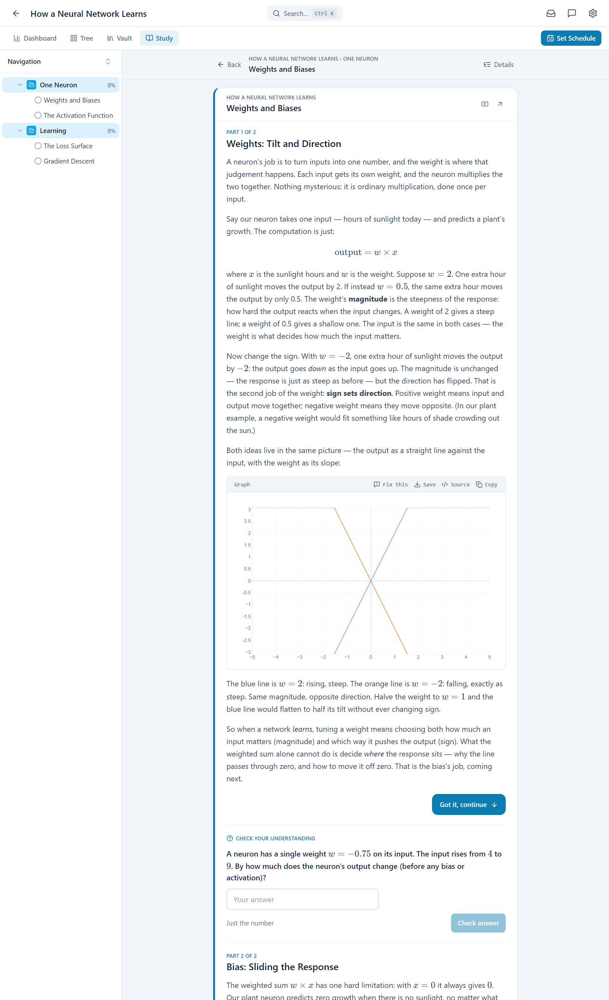

<picture>
  <source media="(prefers-color-scheme: dark)" srcset="brand/terramentor-wordmark-dark.svg">
  
</picture>

A local-first **mastery engine** for self-directed learners.

<p align="center">
  
</p>

<p align="center"><sub>A topic's study feed. The lesson, the chart and the question are written for
that topic by whichever model you point the app at; the answer key is then solved again,
cold, by a second pass, and a question whose key does not survive that is never served.</sub></p>

Most study tools help you *organise* material. This one is built around a harder
question: **can you prove you actually know it?** It plans a curriculum against
your deadline, teaches it as a stream of cards, refuses to mark a topic complete
until you have demonstrated it, and brings back what you are forgetting.

Everything runs on your machine — SQLite on disk, a local model via
[Ollama](https://ollama.com) (or any OpenAI-compatible endpoint you point it at).
Nothing phones home: no telemetry, no account, no vendor. What network traffic there
is goes to the model endpoint you chose, to a resource search while the AI drafts a
project (on by default, one switch to turn off), and to two features that ship off.
[SECURITY.md](SECURITY.md) lists every outbound connection and tells you how to
verify the list with a packet capture rather than taking our word for it.

**Every AI feature is optional.** With no model reachable, the app is a capable
study planner: it schedules, tracks, serves your own notes and saved questions as
reading cards, and runs spaced repetition. AI adds lessons, questions, tutoring
and visuals on top — it is never a dependency.

---

## The loop

**Discover → Plan → Study → Prove → Remember → Repeat.** See
[CoreIdea.md](CoreIdea.md) for the philosophy and
[docs/ARCHITECTURE.md](docs/ARCHITECTURE.md) for how it is built.

### Discover
- **AI curriculum generation** — describe a subject, get a phased tree of topics
  with an overview per topic, streamed live and cancellable.
- **Import** — portable JSON, or a `.studyvault` bundle that carries the source
  files too. A course written by a large cloud model can be pasted straight in:
  **Projects → New → With a chat model** hands you the prompt to paste, and any
  phase can be deepened with real teaching material later, one reply at a time.
- **Capture** — clip a link, a paragraph or a photo into an Inbox project from
  anywhere with the `c` key. It becomes a topic like any other, so flashcards,
  questions and mastery all work on it.
- **Declare a study language** per project, and the content *and its quality
  checks* follow it.

### Plan
- Set a start date, a deadline and the days you study. The calendar is
  allocated across the tree by leaf weight with a depth discount, phase-aware,
  and the plan is measured in topics per study day — the app never asks you to
  price a topic in hours, because it has no way to check that estimate.
- **Timeline**, **calendar** (month/week/day) and a cross-project **schedule
  board** where every project shares one time axis.
- **Pace tracking** measures you against the schedule, not against the calendar,
  and recalibration re-plans only what is still open.

### Study
- **The home page is a learning feed**, not a dashboard: lessons, inline
  questions, flashcards, recall prompts and chapter checkpoints, in an order the
  engine picks. Overdue work is served first.
- **AI tutor** per topic, with retrieval over your own uploaded files.
- **Visuals the model writes as code** — diagrams, charts, animations, sandboxed
  interactive widgets — each checked, sanitised, and repaired automatically when
  a model gets one wrong.
- **Paper practice** — work an exercise by hand, photograph it, and have the page
  read and marked against a rubric. Exams are still written on paper.
- **The Vault** — upload PDFs, Office documents and notes per project. Hybrid
  keyword + semantic retrieval; formulas that a PDF's text layer drops are
  recovered from the rendered page.

### Prove
- **Bayesian Knowledge Tracing** per topic, with the guess floor set by question
  format — a true/false is not the same evidence as a multi-step calculation.
- **The mastery gate**: completing a topic can require proof. Three modes —
  off, advisory (offer, but let the learner override) and enforced. **Skip is
  always allowed**, and stays visibly distinct from a verified completion.
- **Boss Fights** — a per-topic assessment that closes the gate honestly.

### Remember
- **FSRS-6 spaced repetition** for flashcards (via `ts-fsrs`), capped so a backlog
  can't become a wall of 600 due cards. Every rating is kept in a local review log, an
  imported Anki deck brings its history, and once a few hundred reviews exist the 21
  parameters can be fitted to you — applied only when the fit beats the defaults on
  reviews it never saw.
- **Decay** — proven topics fade on a configurable curve and return as *ghost
  questions* mixed into later quizzes, refreshing the timer when answered.

### Across the whole library
- **Atlas** — every topic you have ever studied, grouped by meaning rather than
  by course: proven regions painted in, and the topics two of your courses both
  teach listed side by side.
- **Mastery transfer** — prove standing waves in one course and the same topic in
  another starts with a head start, capped so it can never close a gate on its
  own.

---

## Quick start

### As a desktop app (simplest)

Download the zip for your system from the
[releases page](https://github.com/ValeraZSD/terramentor/releases), unpack it
anywhere, and start `Terramentor.exe` (Windows), `Terramentor.app` (macOS,
Apple Silicon) or `./terramentor.sh` (Linux). Nothing to install: the zip carries its own runtime.
The app opens in its own window; closing the window stops it. Your library
lives in your user data folder (Settings → General → *This computer* opens it),
so updating is unpacking the next zip and deleting the old folder.

Windows will warn once that the launcher is unsigned (*More info → Run
anyway*); macOS needs a right-click → *Open* the first time. Details, the data
folder per system, portable use and how the package is built: [docs/DESKTOP.md](docs/DESKTOP.md).

The interface is available in twelve languages (Settings → General →
*Language*); see [docs/I18N.md](docs/I18N.md) to correct one or add yours.

### With Docker (for a server, or always-on)

Nothing to install but Docker — no Node, no toolchain, no build step.

```bash
curl -O https://raw.githubusercontent.com/ValeraZSD/terramentor/main/docker-compose.yml
docker compose up -d
```

Then open <http://127.0.0.1:3001>. There is no account to create and no API key
to paste. The port is published to loopback only, on purpose; everything durable
lives on the `study-data` volume, so backing that up backs up your whole library.

AI features look for [Ollama](https://ollama.com) on the host machine (a 9–14B
instruct model is a sensible floor). Everything else works without one.

**To update:**

```bash
docker compose pull && docker compose up -d
```

Your database is untouched. `latest` follows full releases only — a prerelease is
published but never becomes `latest` — and pinning `:1.0` instead takes patches
and nothing else.

### From source

For contributors, and for anyone who would rather run it directly. **Requirements:**
Node.js **22.15+** (24+ recommended). Below that, everything runs except reading a
modern Anki `.apkg`, which needs the zstd support that arrived in 22.15 — the
import says so plainly rather than failing obscurely.

```bash
git clone https://github.com/ValeraZSD/terramentor.git
cd terramentor
npm install
npm run dev
```

The dev server opens at `http://localhost:5173`; the API runs on `3001`.
To update: `git pull && npm install && npm run build`.

### Running it as a real app

```bash
npm run standalone
```

This builds the frontend and serves it from the Express process on a single
origin (`http://localhost:3001`, or HTTPS if certificates are present in
`.certs`), so it installs as a PWA — no dev server in a window.

`npm run desktop` does the same and opens the app window the packaged build
opens, on the checkout's own database; `npm run build:desktop` produces the
zip for this machine (`release/`). See [docs/DESKTOP.md](docs/DESKTOP.md).

### Using it from your phone

Your phone can use the same library — the same review queue, the same schedule —
by talking to your own computer. Nothing is uploaded and there is no account.

The server binds `127.0.0.1` by default, so it is not reachable from your
network until you deliberately expose it. The supported route is
[Tailscale](https://tailscale.com) (free for personal use, no port forwarding,
no router settings) plus the built-in password gate (Settings → Security);
`tailscale serve` also supplies the HTTPS that the *Add to Home Screen* prompt
and clipboard access on mobile both require.

Step by step, including what to do when it does not work:
**[docs/REMOTE_ACCESS.md](docs/REMOTE_ACCESS.md)**.

---

## Versions, updates and reporting problems

**Which version am I running?** Settings → General → About says so — the version,
the commit, how it was installed — with a one-press **Copy details** that puts the
same facts into a bug report.

**Which versions are stable?** Whichever one
[the releases page](https://github.com/ValeraZSD/terramentor/releases) shows as
*Latest*. Work in progress is tagged a **prerelease** — installable, but never
shown as Latest and never offered by the update check. Version numbers are
semantic: **a
minor bump may migrate your database, a patch never does**, and every release says
which in its [changelog](CHANGELOG.md) entry.

**What 1.0 promises.** That the things your data lives in are settled. Your library
keeps opening across upgrades, migrations only ever run forward and are named in the
changelog, and the export format, the Anki import and export, the environment
variable names and the compose file do not change shape unless the major number
changes with them. The HTTP API the frontend talks to is internal, and carries no
such promise.

**Telling you about a new one is opt-in.** There is a **Check now** button, and a
**Check daily** toggle that ships **off**. When it finds one, a strip appears above
the page with what you have, what is available, the release notes and the exact
command for your kind of install; nothing is installed for you. `SECURITY.md`
describes exactly what the check sends and how to verify it with a packet capture.

**Before it migrates your database it copies it** — once per version change, to
`terramentor.db.pre-<version>.bak` beside the original, three most recent kept. So a
release that turns out badly is recoverable even though migrations here are
forward-only.

**Found a problem?** Settings → General → About → **Report a problem**. It gathers
the version, commit, install kind and configured model, shows you the text, and
opens a pre-filled form. Nothing is sent from the app. There is a form
specifically for *the AI got something wrong* — a lesson or a marked answer that
is factually wrong is one of the most useful reports this project receives, and it
needs no code to file. See [CONTRIBUTING.md](CONTRIBUTING.md).

---

## Configuration

All in **Settings**, grouped into General / Learning / AI & Models / Search links /
Data.

| Setting | What it does |
|---|---|
| **AI provider** | Ollama, or any OpenAI-compatible endpoint (base URL + key). |
| **Embeddings** | Separate provider and model — embeddings can run on Ollama while chat runs elsewhere. Without one, search is keyword-only and the atlas is unavailable. |
| **Mastery gate** | `off` / `advisory` / `enforced`, plus the threshold, the pass mark and the decay window. |
| **Learner profile** | Free text about you, injected into every AI context so explanations land at the right level. |
| **Advanced visuals** | Whether to offer the expensive visual kinds; auto-detection guesses from the model name and can be overridden. |
| **PDF math recovery** | Vision or OCR re-reading of pages whose formulas the text layer dropped. |
| **Search links** | Where the app offers to send you to research a topic yourself. Declarative, runs no code — see [docs/SEARCH_PROVIDERS.md](docs/SEARCH_PROVIDERS.md). |
| **Appearance** | Four themes on a light/dark axis, plus a configurable accent. |
| **Security** | Optional single-user password + an API key for scripted clients. |

---

## Documentation

| Document | What's in it |
|---|---|
| [docs/GETTING_STARTED.md](docs/GETTING_STARTED.md) | A five-minute tour of the loop for a new learner: the feed, the tree, pace, the gate, reviews, the Vault. |
| [CoreIdea.md](CoreIdea.md) | The philosophy — what this is for, and what it refuses to be. |
| [docs/ARCHITECTURE.md](docs/ARCHITECTURE.md) | How the system is put together and why. **Start here to contribute.** |
| [TECHNICAL_DOCUMENTATION.md](TECHNICAL_DOCUMENTATION.md) | Subsystem-by-subsystem reference: schema, engines, API surface. |
| [docs/DESKTOP.md](docs/DESKTOP.md) | Running it as a desktop program: the tray icon, starting at sign-in, where your data is, and how the package is built. |
| [docs/REMOTE_ACCESS.md](docs/REMOTE_ACCESS.md) | Reaching your library from your phone over Tailscale, step by step. |
| [docs/SEARCH_PROVIDERS.md](docs/SEARCH_PROVIDERS.md) | The search-provider manifest schema and what is validated. |
| [docs/ADDONS.md](docs/ADDONS.md) | Design for real add-ons and a marketplace. Nothing in it is built. |
| [ROADMAP.md](ROADMAP.md) | What is next, what is deferred and why, and what this will never do. |
| [CHANGELOG.md](CHANGELOG.md) | What changed in each release — and whether it touches your database. |
| [SECURITY.md](SECURITY.md) | Threat model, what is *not* protected, and how to verify the no-telemetry claim. |
| [CONTRIBUTING.md](CONTRIBUTING.md) · [CLA.md](CLA.md) | How to contribute. |

---

## Development

```bash
npm run dev          # Vite (5173) + Express (3001), both on loopback
npm run server       # API only
npm run client       # frontend only
npm run standalone   # build + serve the installable app from Express
```

`DEV_LAN=1 npm run dev` also binds Vite to the LAN, for testing on a phone. It is
opt-in on purpose: a dev server answers any origin and serves from the project
root, so that flag is for a network you trust. The installable app
(`npm run standalone`, Docker, desktop) is unaffected.

Verify a change:

```bash
npx tsc --noEmit && node --check server/index.js
```

…then `npm test`, which runs every guard suite. They are deterministic, run
against a scratch database and call no model, and CI runs the same command on
Node 22 and 24. See
[docs/ARCHITECTURE.md §10](docs/ARCHITECTURE.md#10-how-to-verify-a-change).

---

## Troubleshooting

| Symptom | Cause |
|---|---|
| **AI features do nothing** | No model reachable. Check Settings → AI & Models; everything else keeps working. |
| **Generation is slow** | Expected on local hardware. Generation runs in the background — navigate away, it survives. |
| **Semantic search finds nothing** | No embedding model. Retrieval falls back to keyword search; the atlas reports itself unavailable. |
| **Documents indexed before you added an embedding model stay unindexed** | They do not self-heal — use Settings → "Re-index all". |
| **A generated visual is blank or wrong** | It should self-repair once. If a kind fails repeatedly, the model is probably too small for it — set Advanced visuals to `basic`. |
| **Database is locked** | Only one backend process at a time. |

---

## Licence

Copyright © 2026 Valerii Kozhevets (ValeraZSD). **AGPL-3.0-or-later** — see
[LICENSE](LICENSE); third-party code is listed in
[THIRD_PARTY_NOTICES.md](THIRD_PARTY_NOTICES.md).

Because the app is typically served over a network (your phone reaching your
desktop), AGPL §13 applies: the running app carries a **"Get the source code"**
link in Settings → General → About.
