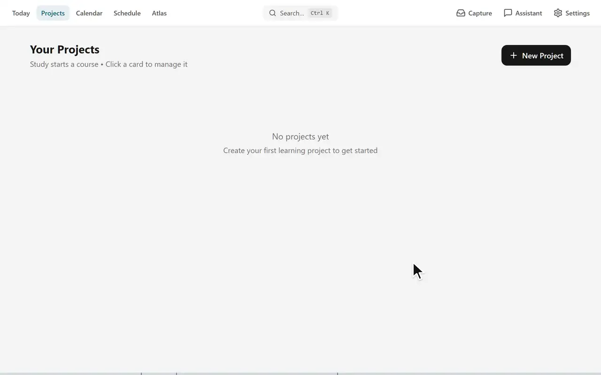
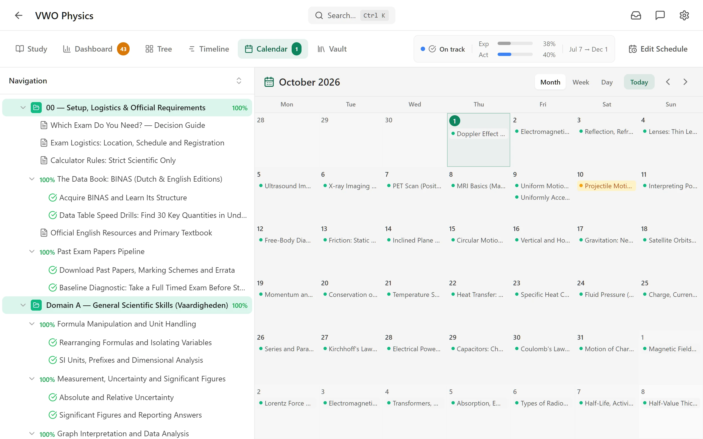
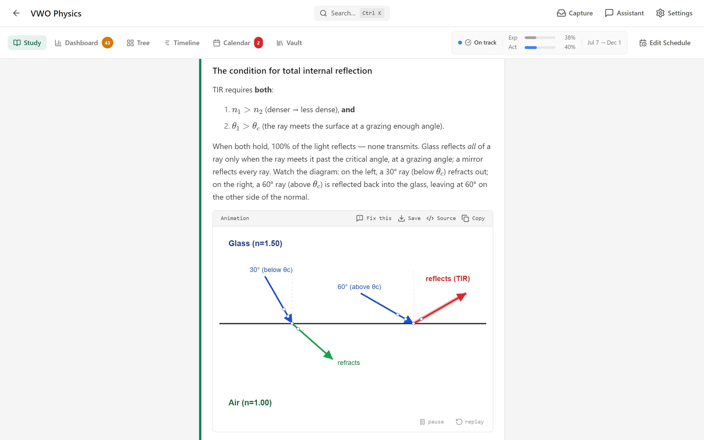
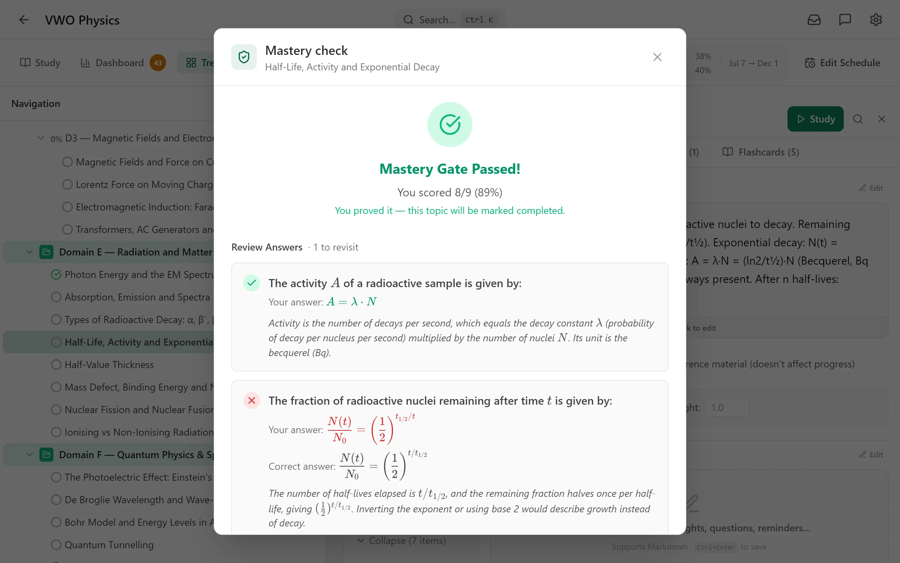
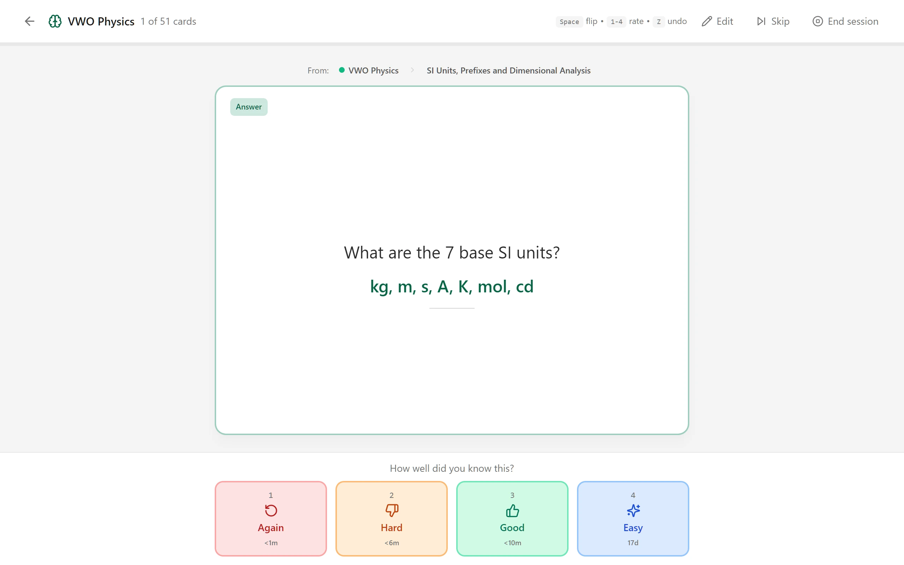
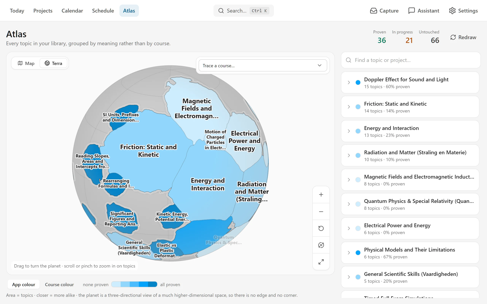

<p align="center">
  <picture>
    <source media="(prefers-color-scheme: dark)" srcset="brand/terramentor-wordmark-dark.png">
    
  </picture>
</p>

<p align="center"><b>Learn almost anything, from scratch to proven mastery. AI gets better, so do you.</b></p>

<p align="center">
  <a href="https://github.com/ValeraZSD/terramentor/releases">Download</a> ·
  <a href="#install">Install</a> ·
  <a href="docs/GETTING_STARTED.md">First steps</a> ·
  <a href="CHANGELOG.md">Changelog</a>
</p>

<p align="center">
  <a href="https://github.com/ValeraZSD/terramentor/releases"></a>
  <a href="LICENSE"></a>
  <a href="SECURITY.md"></a>
  
</p>

Tell Terramentor what you want to learn and by when. The model you connect drafts the course
and writes every lesson, diagram and question. Terramentor plans the course against your
deadline, asks you to prove each topic rather than tick it off, and brings back what you are
starting to forget. The app is free and has no account; the model is paid per use to its
provider, under your own key, or runs on your own computer.



## How it works

The pictures below come from one physics course for the Dutch pre-university exam (VWO).

### Discover

Describe what you want to learn and the model drafts a course: phases, then topics, each with an
overview, in your language. Add a book or your notes and the course follows their chapters, and
its lessons are written from their pages. The draft runs in the background, so you can keep
studying meanwhile. You can also import a course file or an Anki deck.

### Plan

Give it a start date, a deadline and the days of the week you study. Bigger topics get more
days, and pace is measured against that plan. Change the dates and whatever is
still open is planned again.



### Study

The home page is a stream: lessons in short parts, a question after each part, flashcards, and
questions from earlier topics you are starting to forget. Diagrams, charts and animations are
written by the model as code and checked before you see them. The assistant, open beside any
screen, teaches the topic in front of you, answers from your own files, and can change a course
for you, with Undo.



### Prove

A topic is proven when you pass its mastery check (choices, numbers you work out, answers you
type, steps you put in order), or when you work an exercise on paper, photograph it and have it
marked. Before you see a question with one right answer, the model answers it again without the key, and a key it
disputes is thrown out. That catches slips, not a misconception the model holds both times. You
can always skip a topic; it then stays marked as skipped, not as known.



### Remember

Flashcards come back just before you would forget them (scheduled with FSRS-6, fitted to your
own reviews once there are enough of them).
Anki decks come in with their media and review history and go back out as `.apkg`.



### The atlas

Every topic in your library on a planet you can turn, placed by what it is about rather than
which course it belongs to. Pick a course and it replays the order you finished its topics in,
and can save the replay as a video or a GIF.



## Why not a chatbot and Anki?

A chatbot explains anything you ask, but keeps no plan, does not know what you have proved, and
never asks you about last month's topic. Anki keeps what you put in it, but you write the cards.
Terramentor puts the course, the deadline, the proof and the review in one loop.

## The model is the teacher

Lessons and questions are written by the model you connect, pitched at what you told it about
yourself. Switch to a newer model and the next lessons are better, with no app update.

A hosted model is the right choice for most people. Open models that fit an 8 GB graphics card
write weaker lessons, slowly; the ones that teach well want 24 GB of video memory or more. Hosted
is cheap here because a lesson is written once and kept: a fast, low-cost model such as
GLM-5.3-Flash costs about US$0.20 per day of study.

The first screen connects one: **Connect OpenRouter** signs you in at openrouter.ai and brings back a key you own,
or paste a key for any OpenAI-compatible service, or point it at Ollama, LM Studio or llama.cpp.
Without a model the app still opens your courses, saved lessons and flashcards.

## Your data

Your library is one SQLite file on your own disk, with a folder beside it for documents and card
media. Nothing reports back to this project. What leaves the machine is what a lesson or an
answer needs, sent to the model provider you chose, and, while a new course is drafted, web
searches for reading on its topics (on by default, one switch in Settings). [SECURITY.md](SECURITY.md) lists
every outbound connection.

## Install

**Desktop.** Download the zip for your system from the
[releases page](https://github.com/ValeraZSD/terramentor/releases), unpack it and start
`Terramentor.exe` (Windows), `Terramentor.app` (macOS, Apple Silicon) or `./terramentor.sh`
(Linux). There is nothing else to install. The launcher is unsigned, so Windows asks once
(*More info → Run anyway*) and macOS wants a right-click → *Open* the first time.

**Docker:**

```bash
curl -O https://raw.githubusercontent.com/ValeraZSD/terramentor/main/docker-compose.yml
docker compose up -d
```

Then open <http://127.0.0.1:3001>.

**From source** (Node.js 22.19 or newer):

```bash
git clone https://github.com/ValeraZSD/terramentor.git
cd terramentor
npm install
npm run standalone
```

Updates, the Docker password and phone access are in [docs/INSTALL.md](docs/INSTALL.md). The
interface comes in twelve languages ([docs/I18N.md](docs/I18N.md)).

## Documentation

- [First steps](docs/GETTING_STARTED.md): a five-minute tour.
- [Install and update](docs/INSTALL.md): desktop, Docker, from source, phone access, upgrades.
- [Why it exists](CoreIdea.md): what this is for, and what it is not.
- [Architecture](docs/ARCHITECTURE.md): React and TypeScript, Node and SQLite, and why. Start
  here to contribute.
- [Technical reference](TECHNICAL_DOCUMENTATION.md): schema, engines, API.
- [Security](SECURITY.md): threat model and every outbound connection.
- [Contributing](CONTRIBUTING.md), [Roadmap](ROADMAP.md), [Changelog](CHANGELOG.md).

Found a wrong lesson or a bug? **Settings → General → About → Report a problem** fills in
GitHub's form for you to check and send.

## Licence

Copyright © 2026 Valerii Kozhevets (ValeraZSD). **AGPL-3.0-or-later**, see [LICENSE](LICENSE);
third-party code is listed in [THIRD_PARTY_NOTICES.md](THIRD_PARTY_NOTICES.md). The running app
links to its own source under Settings → General → About.
